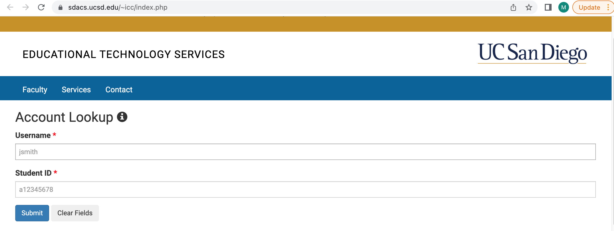

# MacOS Remote Access Tutorial
by May Chenh

**Step 1:** Install VSCode

First, install VSCode. VSCode is a popular IDE that lets users write and edit code easily. You can download this application with this [link](https://code.visualstudio.com/Download). Make sure to choose the option that corresponds to your OS.

Open the file after it's done downloading and follow all of the on-screen instructions to install the IDE. When finished, you should see something that looks like this.

**Step 2:** Remotely Connect

Remotely connecting allows you to use your local computer to access a remote computer over the Internet and do work remotely from where you are. Typically, you will have an unique account given to you. For this class, you can look up your course-specific account with this [link](https://sdacs.ucsd.edu/~icc/index.php). Use the username you usually use for your other accounts (this is usually first initial and last name).

Under "additional accounts" you should see your usernames for your other accounts. For 15L, it should be the one that starts with cs15lsp22 followed by three letters. (The sp22 part might change to correspond with your quarter). If this is your first time using this account, you will need to set your password up by pressing "Change your Password" for this account and following the instructions.

Next, open a terminal and 

$ ssh cs15lsp22zz@ieng6.ucsd.edu

**Step 3:** Try Out Basic Commands

**Step 4:** Move Files with scp

**Step 5:** Set up a SSH Key

**Step 6:** Optimize Remote Running
